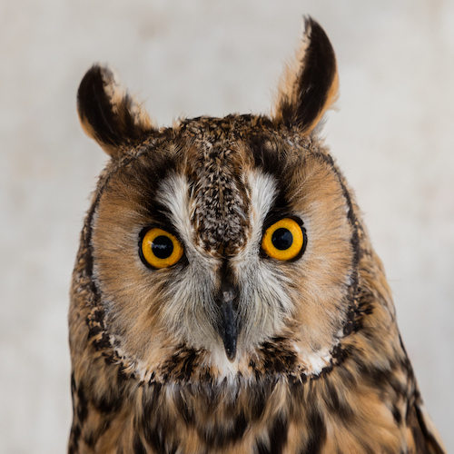

# GitHub-flavored Markdown

## Tasks

- [x] [external link](README.md#external-link)
- [x] [internal link](README.md#internal-link)
- [x] [images](README.md#images)
- [x] [emojis](README.md#emojis)
- [x] [tables](README.md#tables)

## External link

[GitHub documentation](https://help.github.com/en)

## Internal link

[Images folder](img/)

## Images

## Emojis

:eagle:

## Tables

Names | Class
--- | ---
Rory :cactus: | WebDev
Elsa :snail: | Marketing
Tim :pig_nose: | SysAdmin
Marvin :gem: | WebDev
Lynnyrd :volcano: | Astrophysics

